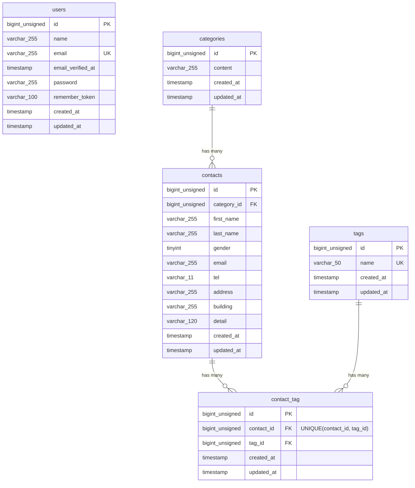

# COACHTECH お問い合わせフォーム

## 概要

お問い合わせフォームアプリケーションです。

ユーザーはお問い合わせ内容を入力し、確認画面を経由して送信できます。
管理者はお問い合わせ一覧の閲覧、検索、詳細確認、削除、タグ管理、CSVエクスポートができます。

また、公開APIとしてお問い合わせデータの一覧取得・詳細取得・作成・更新・削除機能を実装しています。

---

## 使用技術

| 項目           | バージョン             |
| -------------- | ---------------------- |
| PHP            | 8.2                    |
| Laravel        | 10.x                   |
| MySQL          | 8.0                    |
| Nginx          | latest                 |
| Docker         | latest                 |
| Docker Compose | latest                 |
| Laravel Sail   | latest                 |
| phpMyAdmin     | latest                 |
| Tailwind CSS   | 3.4.x                  |
| Node.js / npm  | latest（Laravel Sail） |

---

# 環境構築

## 1. リポジトリをクローン

GitHubからプロジェクトを取得します。

```bash
git clone https://github.com/kei-aichi/contact-form-app.git
```

---

## 2. プロジェクトディレクトリへ移動

```bash
cd contact-form-app
```

---

## 3. Composerパッケージのインストール

Laravelおよび開発に必要なComposerパッケージをインストールします。

```bash
docker run --rm \
-u "$(id -u):$(id -g)" \
-v "$(pwd):/var/www/html" \
-w /var/www/html \
-e COMPOSER_CACHE_DIR=/tmp/composer_cache \
laravelsail/php82-composer:latest \
composer install
```

---

## 4. .envファイルの作成・設定

`.env.example` をコピーして `.env` ファイルを作成します。

```bash
cp .env.example .env
```

`.env` を開き、データベース接続情報が以下のようになっていることを確認してください。

```env
DB_CONNECTION=mysql
DB_HOST=mysql
DB_PORT=3306
DB_DATABASE=laravel
DB_USERNAME=sail
DB_PASSWORD=password
```

> **重要**
>
> `DB_HOST` は `localhost` や `127.0.0.1` ではなく、Dockerコンテナ名である `mysql` を指定してください。

---

## 5. Sailエイリアスの設定（任意）

毎回 `./vendor/bin/sail` と入力しなくてもよいように、Sailコマンドのエイリアスを設定できます。

### zshの場合

```bash
echo "alias sail='[ -f sail ] && bash sail || bash vendor/bin/sail'" >> ~/.zshrc
source ~/.zshrc
```

### bashの場合

```bash
echo "alias sail='[ -f sail ] && bash sail || bash vendor/bin/sail'" >> ~/.bashrc
source ~/.bashrc
```

以降は `./vendor/bin/sail` の代わりに `sail` コマンドが利用できます。

---

## 6. Sailを起動

Dockerコンテナをバックグラウンドで起動します。

```bash
sail up -d
```

---

## 7. フロントエンドのセットアップ

Sailコンテナが起動していることを確認してから、npmパッケージをインストールします。

```bash

sail npm install

```

---

## 8. Vite開発サーバーを起動

別ターミナルを開き、以下のコマンドを実行してください。

```bash
sail npm run dev
```

## Viteは開発中は起動したままにしてください。

---

## 9. phpMyAdmin

Sail起動後、以下のURLからphpMyAdminへアクセスできます。

```
http://localhost:8080
```

---

## 10. アプリケーションキーの生成

以下のコマンドを実行します。

```bash
sail artisan key:generate
```

---

## 11. データベースのマイグレーション・初期データ投入

以下のコマンドでテーブルを作成し、初期データを投入します。

```bash
sail artisan migrate --seed
```

既存のデータベースをリセットして初期データを再投入する場合は、以下を実行してください。

```bash
sail artisan migrate:fresh --seed
```

---

## テスト実行

以下のコマンドでテストを実行できます。

```bash
sail artisan test
```

---

## ダミーアカウント情報

- name Test User
- email test@example.com
- password password

---

## ER図



---

## APIエンドポイント一覧

| HTTPメソッド | URI                        | 概要                 | ステータス      |
| ------------ | -------------------------- | -------------------- | --------------- |
| GET          | /api/v1/contacts           | お問い合わせ一覧取得 | 200 / 422       |
| GET          | /api/v1/contacts/{contact} | お問い合わせ詳細取得 | 200 / 404       |
| POST         | /api/v1/contacts           | お問い合わせ作成     | 201 / 422       |
| PUT          | /api/v1/contacts/{contact} | お問い合わせ更新     | 200 / 404 / 422 |
| DELETE       | /api/v1/contacts/{contact} | お問い合わせ削除     | 204 / 404       |

---

## 開発環境URL

| 項目             | URL                   |
| ---------------- | --------------------- |
| アプリケーション | http://localhost      |
| phpMyAdmin       | http://localhost:8080 |

---

## 作成者

新海 圭一郎
